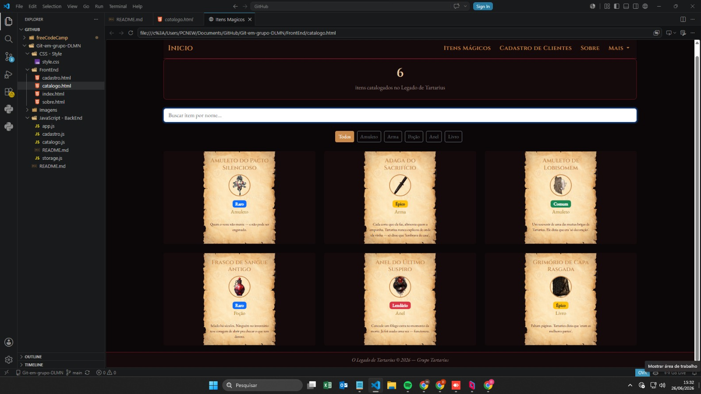
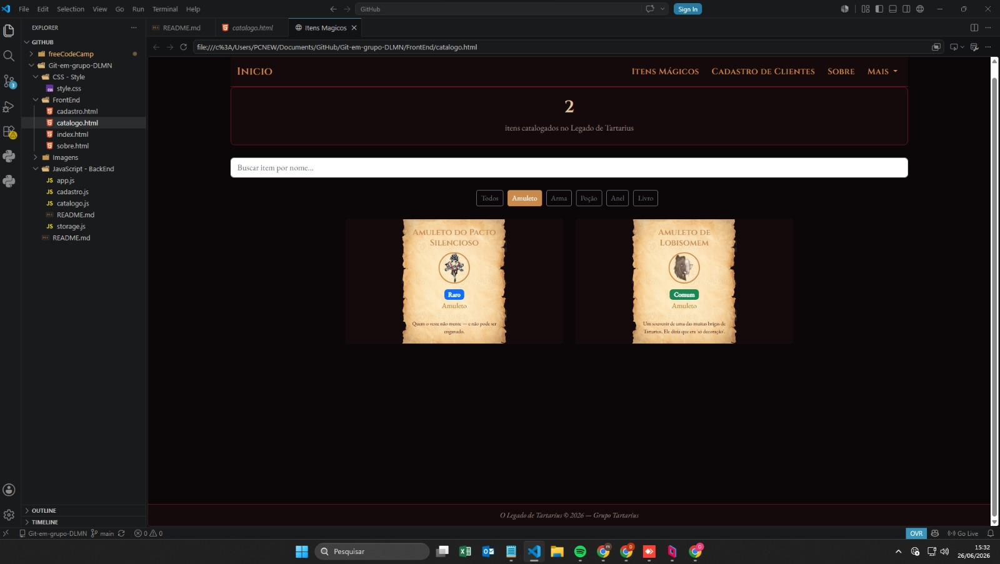
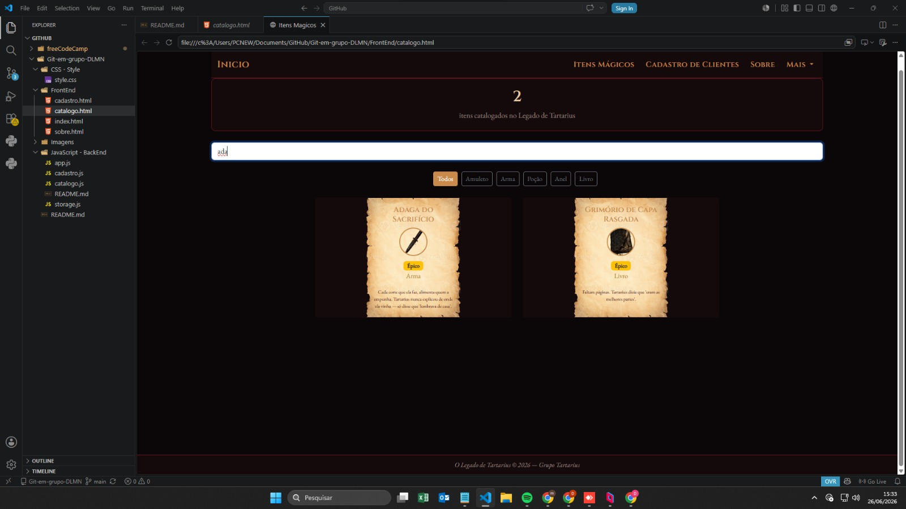
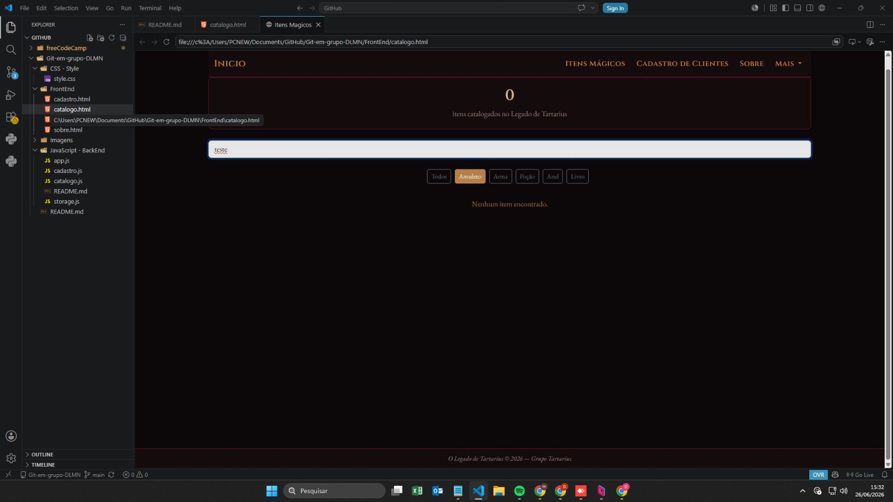

# Legado de Tartarius

> O legado sombrio deixado por Tartarius continua vivo através dos registros preservados neste sistema.

---

## Sobre o Projeto

**Legado de Tartarius** é um sistema web desenvolvido para a disciplina de Desenvolvimento Web utilizando HTML, CSS, Bootstrap, JavaScript e Git.

O objetivo do projeto é reconstruir e organizar registros perdidos após a queda de Tartarius, permitindo o gerenciamento de informações através de uma interface moderna, responsiva e interativa.

---

## Integrantes

| Nome         | Função        |
| ------------ | ------------- |
|  Daniel      | Tech Lead     |
|  Luis        | Front-End     |
|  Matheus     | Back-End      |
|  Nathalia    | UX / Conteúdo |

---

## Tecnologias Utilizadas

* HTML5
* CSS3
* Bootstrap 5
* JavaScript
* GitHub
* GitHub Projects / Trello / Notion (Kanban)

---

## Estrutura do Projeto

```text
Git-em-grupo-DLMN/
│
├── FrontEnd/
│   ├── index.html
│   ├── catalogo.html
│   ├── cadastro.html
│   └── sobre.html
│
├── JavaScript - BackEnd/
│   ├── app.js
│   ├── cadastro.js
│   ├── catalogo.js
│   └── storage.js
│
├── CSS - Style/
│   └── style.css
│
├── Imagens/
│
└── README.md
```

---

## Fluxo de Trabalho (Git)

### Antes de iniciar qualquer tarefa

```bash
git pull origin main
```

Verifique se seu repositório está atualizado antes de começar.

---

### Após concluir uma tarefa

```bash
git add .
git commit -m "feat: descrição da tarefa"
git push origin main
```

---

### Padrão de Commits

#### Funcionalidades

```bash
feat: cria página inicial
feat: implementa localStorage
feat: adiciona filtro de categorias
```

#### Correções

```bash
fix: corrige busca em tempo real
fix: corrige renderização dos cards
```

#### Estilo

```bash
style: ajusta navbar
style: melhora responsividade mobile
```

#### Documentação

```bash
docs: atualiza README
```

#### Refatoração

```bash
refactor: reorganiza funções do app.js
```

---

## Regras da Equipe

### Obrigatório

* Atualizar o Kanban constantemente.
* Fazer commits pequenos e frequentes.
* Testar antes de enviar alterações.
* Avisar quando iniciar uma tarefa.
* Avisar quando finalizar uma tarefa.
* Manter o código organizado e comentado.

### Proibido

* Alterar código de outro integrante sem avisar.
* Fazer commits genéricos.
* Commitar código quebrado.
* Deixar tarefas sem responsável.
* Ignorar revisões da equipe.

---

## Organização do Código

### HTML

```html
<!-- Navbar -->

<!-- Conteúdo Principal -->

<!-- Rodapé -->
```

### CSS

```css
/* Navbar */

/* Hero */

/* Cards */

/* Formulários */

/* Rodapé */

/* Animações */
```

### JavaScript

```javascript
// Dados

// Renderização

// Filtros

// Eventos

// LocalStorage
```

---

## Kanban

O projeto utiliza metodologia Kanban com as seguintes colunas:

* Backlog
* A Fazer
* Em Andamento
* Revisão
* Concluído

Cada tarefa deve possuir:

* Título
* Responsável
* Descrição
* Critério de conclusão

---

## Checklist de Entrega

* [✓] Página inicial concluída
* [✓] Catálogo funcional
* [✓] Cadastro funcional
* [✓] Página Sobre concluída
* [✓] Busca em tempo real
* [✓] Filtro por categoria
* [✓] Contador de itens
* [✓] LocalStorage funcionando
* [✓] README atualizado
* [✓] Kanban atualizado
* [✓] Todos os integrantes possuem commits
* [✓] Projeto revisado pela equipe

---

## Contexto Narrativo

Após a queda de Tartarius, grande parte dos registros foi perdida. O sistema **Legado de Tartarius** foi criado para restaurar e preservar informações críticas deixadas por ele.

Agora cabe aos novos guardiões reconstruir esse conhecimento, catalogar informações e impedir que o legado desapareça para sempre.

---

## Repositório

GitHub: [Git-em-grupo-DLMN](https://github.com/DalPraSenai/Git-em-grupo-DLMN)

## Kanban

Board: [prova-pratica-michel](https://trello.com/invite/b/6a31ea0b0526f0de0f0ec6da/ATTI1d2a8ed6645da41def1fe9a629f016ad9ABE027A/prova-pratica-michel)

---

## Troubleshooting: imagens/itens não atualizam

Se você editou os itens em `app.js` e a mudança não aparece no site, não é bug — é o `localStorage` guardando os dados antigos.

### Por que acontece

O `storage.js` só salva os itens iniciais uma vez, na primeira abertura do site:

```js
export function inicializarItens(itensIniciais) {
    if (carregar('itens').length === 0) {
        salvar('itens', itensIniciais);
    }
}
```

Depois disso o `localStorage` já tem dados, então nunca mais sobrescreve — mesmo que você mude o `app.js`.

### Como resolver

1. Abra o site no navegador
2. Aperte **F12** e vá no **Console**
3. Execute:
```js
localStorage.removeItem('tartarius_itens')
```
4. Confirme que limpou:
```js
localStorage.getItem('tartarius_itens') // deve retornar null
```
5. Recarregue a página com **F5**

---

## Screenshots

### Catálogo completo


### Filtro por categoria


### Busca em tempo real


### Nenhum resultado encontrado
